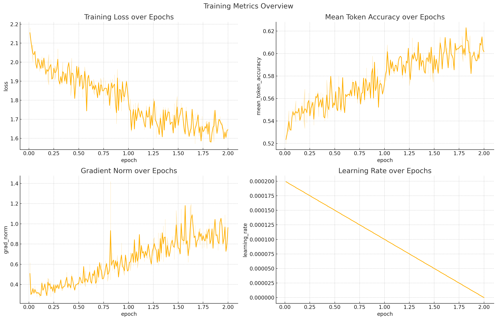

# Reddit-Finance LLM Fine-Tuning & RAG Pipeline

This project fine-tunes the Llama-2-7b LLM using question-answer (QA) pairs scraped from Reddit finance communities, and supports Retrieval-Augmented Generation (RAG).

---

## Functionality Overview

### Reddit QA Collection
Subreddits scraped include:
- r/wallstreetbets
- r/investing
- r/personalfinance
- r/stocks
- r/cryptocurrency
- (Total of 13 listed in `stats.log`)

Collected QAs are stored in `reddit_finance_qa.jsonl` files.


### Fine-Tuning with LoRA + 4-bit Quantization

- Loads tokenizer, base model (e.g., LLaMA-2).
- Uses PEFT with LoRA and BitsAndBytes 4-bit quantization.

#### Training Details
- 4-bit quantization using `nf4`
- LoRA: `r=8`, `lora_alpha=16`, `dropout=0.05`
- Batch: 4, Accumulation: 4, Epochs: 2

A csv comparison file comparing base llama with fine-tuned llama can be viewed [here](./comparison.csv)



---

## Retrieval-Augmented Generation (RAG)

### Embedding & Indexing
- Uses `sentence-transformers/all-MiniLM-L6-v2` to embed QAs.
- Embeddings stored in FAISS index: `faiss_index/index.faiss`
- Corresponding QA text saved in: `faiss_index/qa_corpus.pkl`

### Inference
1. Embed query.
2. Retrieve top-k (5) relevant QAs.
3. Format prompt: retrieved QAs + query.
4. Generate answer using fine-tuned LLaMA or using RAG.

A file showing a sample RAG example for a query can be viewed [here](./sampleRAGexample.log)

---


## Dependencies

```bash
pip install transformers peft trl datasets bitsandbytes faiss-cpu sentence-transformers
```

---

## TODO
- Add GUI
- Use another/better LM as a sentence encoder
- Add a profanity filter for reddit comments
